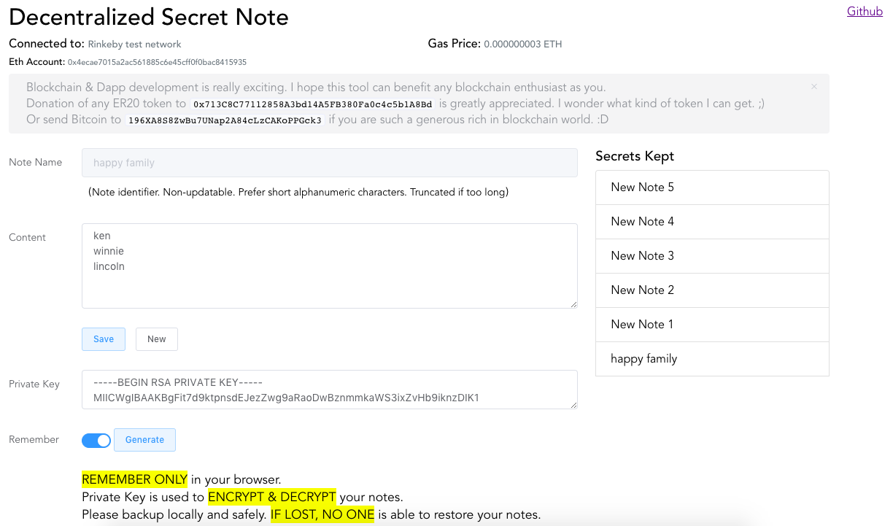

# Decentralized Secret Note

## Why am I doing this?

Blockchain development has always been mysterious to me before.  Lately I finally got a chance to look into it.  

Really learning the blockchain and make something genuinely useful in decentralized scenario is quite difficult.  This idea comes to me because many so-promised life-long storage service can suddenly terminated.  Hence, a publicly accepted blockchain seems a perfect place to put something that you never want to lose.  Your information is never in control of some particular companies.  


## Is it really decentralized and how safe is my secret?

[IPFS]: https://ipfs.io/

All your secret notes have their own name/key which are stored in a Smart Contract in Ethereum.  Each of it points to an address in [IPFS][], which is a distributed web.  The backbone of this tool is completely decentralized and last forever unless Ethereum and IPFS themselves vanished.  This tool itself is open-source and hosted in Github.  You are freely to make a backup and host yourself if you need further assurance.  

The concern you may have is that the data in public blockchain is viewable by anyone.  However, through normal access, each Ethereum address should only be able to see the note names stored by this address only.  Even if your notes' names are revealed, so others can get the address in IPFS, they still cannot see your secret because they are protected by your private key (HTTPS private key, NOT WALLET private key).  And this key should be known by yourself only.  That is why I emphasize that "**IF LOST, NO ONE is able to restore your notes**".


## How to use it

[MetaMask]: https://metamask.io/

The authentication of using this tool is completely based on [MetaMask][] which is another great Dapp in Ethereum.  Hence, this tool DOES NOT require you to input any password or provide your wallet private key.  And for god's sake, you should not provide those info to anybody.  

Once you installed MetaMask in any of your favorite browser and connect your account to Ethereum network, you should see similar screen as below.  



[0xb01b98a50781c454c9daa3d43eb5399ff5b604ee]: https://etherscan.io/address/0xb01b98a50781c454c9daa3d43eb5399ff5b604ee#code

The Ethereum network connected to and what account is currently autenticated are shown at the top of the screen.  The tool hosted can only be used in Main network as the smart contract is deployed there at [0xb01b98a50781c454c9daa3d43eb5399ff5b604ee][].  

Usage steps:  

1. Input your own SSH-generated private key or ad-hoc generate one.  
2. Backup this private key no matter you decided to remember locally in your browser or not.  
3. Input note name and content, press Save.  
4. MetaMask will popup (this might be a little slow) and ask you to confirm the transaction to save your note to Ethereum smart contract.  
5. You only have to pay Gas for saving data in ETH blockchain.  
6. Once your transaction is submitted and confirmed, your note will be listed at the right hand side.  
7. Everytime you login using this ETH account and connected to Main net, you should see all your secrets.  Click on any item to view.  

_Notes: saving & seeing data must have your private key inplace.  Viewing data doesn't need to pay Gas.  Only changing data requires it._


## Donation & Encouragement

Blockchain & Dapp development is really exciting.  I hope this tool can benefit any blockchain enthusiast as you.  

Donation of any ERC20 token to 
`0x713C8C77112858A3bd14A5FB380Fa0c4c5b1A8Bd` is greatly appreciated.  I wonder what kind of token I can get. ;)

Or send Bitcoin to `196XA8S8ZwBu7UNap2A84cLzCAKoPPGck3` if you are such a generous rich in blockchain world. :D


## For developer

If you are a developer, I think you can easily and freely use the source code here to use any Test network and store your secret note there.  You have complete control and what is more important is that you do not need to pay real money for it.  Enjoy.  :D

### Build Setup

``` bash
# install dependencies
npm install

# serve with hot reload at localhost:8080
npm run dev

# build for production with minification
npm run build
```
